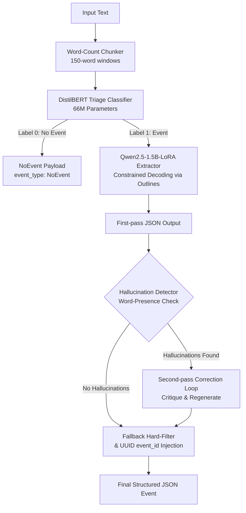

# An Industry Experience Report on Efficient Domain Adaptation and Structured Event Extraction Using Small Language Models

**[Authors]** — [Institution / Organization]

---

## Abstract

Enterprise organizations continuously monitor large volumes of unstructured documents to detect operational risks and supply chain disruptions. Deploying frontier large language models at the scale required for continuous document ingestion is economically prohibitive and yields unpredictable schema compliance. This report presents an industry experience report on engineering a resource-efficient, two-stage event extraction pipeline for supply chain disruption monitoring. Our approach combines a fine-tuned DistilBERT binary classifier (66M parameters) as a compute gatekeeper with a LoRA-adapted Qwen2.5-1.5B generative model (1.54B parameters, 18.46M trainable via LoRA) for structured JSON event extraction, enforced through constrained decoding via the Outlines framework. We describe the construction of a purpose-built dataset of 351 annotated supply chain disruption documents (280 positive, 71 negative) spanning five event types, the deliberate class imbalance engineering in the triage classifier to prioritize recall over precision, and the multi-stage dataset balancing pipeline that transformed a heavily skewed raw corpus (30.7% FacilityHalt) into a near-uniform extraction training set (FacilityHalt 36, ShipmentDelay 36, SupplierInsolvency 35, TariffChange 35, ForceMajeure 33 in the Qwen base set). We report a 47.9% relative improvement in F1 score (from 46.81% to 69.24%) over a zero-shot baseline, 100% schema validity on the test set (versus 23.33% for the baseline), a top-level field F1 of 83.97% and argument-level F1 of 59.23%. We identify a characteristic timestamp hallucination fingerprint in both the baseline and the fine-tuned model, trace systematic FacilityHalt over-prediction to corpus construction bias, and discuss the asymmetric design of the hallucination suppression filter as a necessary consequence of enum-based semantic mapping fields.

**Keywords:** information extraction, supply chain, event detection, LoRA, small language models, constrained decoding, domain adaptation, structured output generation, recall-oriented triage

---

## 1. Introduction

### 1.1 The Industry Problem

Modern enterprise organizations operating in manufacturing, logistics, procurement, and commodity trading are exposed to a continuous stream of global disruptions — port strikes, factory halts, supplier bankruptcies, regulatory tariff changes, and force majeure declarations. Risk officers and procurement managers rely on early detection of these events to activate contingency sourcing plans, re-route shipments, hedge financial contracts, and communicate with downstream customers. Missing a critical signal — for example, a key battery supplier filing for Chapter 11 protection — can cascade into millions of dollars in downstream production shutdowns, long before any formal announcement reaches a structured data feed.

The traditional approach to this monitoring problem involves either manual analyst review (expensive and slow) or rule-based keyword alerting systems (brittle and prone to false positives). The emergence of large language models has opened a new paradigm: using generative models to read unstructured text and return structured, machine-readable event payloads that can be ingested directly into risk dashboards and procurement systems.

However, directly deploying frontier LLMs at the scale required for continuous news monitoring introduces significant practical barriers. A production supply chain risk platform may ingest tens of thousands of news articles, regulatory filings, and operational alerts daily. At an API cost of approximately \$0.002–\$0.015 per 1,000 tokens for frontier models, processing every document with a large LLM is economically prohibitive. Furthermore, frontier models operating in zero-shot regimes frequently fail to comply with strict JSON schemas, generate enum values not present in the schema (as demonstrated by our baseline generating a `LaborDispute` event type absent from the schema), hallucinate entity names from pre-training memory, and produce inconsistent timestamp formats (as low as YYYY-MM-DD plain dates, sometimes natural language like "March 1, 2022").

This report presents our engineering experience in building a practical, resource-efficient alternative: a two-stage pipeline that routes documents through a lightweight classifier before invoking a fine-tuned small language model, achieving high extraction quality at a fraction of the computational cost.

### 1.2 Why Supply Chain?

**Availability of Public Data.** Unlike domains such as healthcare or finance, where training data is heavily restricted by regulation and confidentiality, supply chain disruptions are routinely reported in public media — Wikipedia event articles, news feeds, regulatory announcements, and corporate press releases. This makes it feasible to construct a high-quality annotated dataset without requiring access to proprietary enterprise data streams.

**Well-Defined Event Taxonomies.** Supply chain disruption events map cleanly onto a small set of structurally distinct categories — production halts, logistics delays, supplier failures, regulatory tariff changes, and force majeure declarations. Each category has clearly defined arguments (e.g., a shipment delay has a carrier, origin, destination, and duration), making it possible to define a precise, schema-governed extraction target. This is in contrast to open-domain event extraction, where the event ontology is unbounded.

**Measurable Business Impact.** The downstream business value of correctly detecting and extracting supply chain events is directly quantifiable in terms of procurement cost avoidance, alternative sourcing lead time, and logistics re-routing cost. This enables rigorous ROI analysis appropriate to an industry engineering report.

### 1.3 Contributions

1. **A balanced event extraction dataset** along with a recall-biased triage dataset of 351 annotated documents in the unified raw master (280 positive, 71 negative), with the DistilBERT triage stage trained on 196 documents (125 positive, 71 negative) and the Qwen extraction stage trained on 175 balanced positive examples spanning five event types.
2. **A robust annotation framework** featuring strict guidelines on minimal evidence spans, ISO 8601 timestamp normalizations, and clear semantic boundaries between overlapping event categories.
3. **A two-stage extraction pipeline** combining a lightweight DistilBERT triage gatekeeper (66M parameters) and a LoRA-adapted Qwen2.5-1.5B extractor with a two-pass hallucination self-correction loop.
4. **A parameter-efficient LoRA fine-tuning methodology** demonstrating efficient domain adaptation on sub-2B parameter models with a detailed layer-wise and module-wise weight update norm analysis.
5. **A quantitative business impact and infrastructure analysis** assessing CPU/GPU latency, peak memory footprints, model loading times, and computational cost avoidance.
6. **A structured extraction benchmark** comparing multiple models (Qwen, SmolLM2, TinyLlama) on extraction quality (F1, Top-Level F1, Arguments F1) and strict JSON schema validity.

---

## 2. Background and Related Work

### 2.1 Event Extraction

Event extraction is a structured prediction task in which a system identifies event triggers and their associated arguments from unstructured text. Early approaches relied on hand-crafted features and pattern-matching rules. The shift to neural architectures, particularly BERT-based sequence labeling models [Devlin et al., 2019], substantially improved extraction quality on benchmark datasets such as ACE and ERE. More recently, sequence-to-sequence formulations using T5 and BART have reframed event extraction as conditional text generation [Lu et al., 2021; Paolini et al., 2021].

The advent of instruction-tuned large language models has introduced a new paradigm: prompting a pre-trained model to produce structured event representations directly. While competitive on standard benchmarks, this approach struggles in domain-specific settings where the event schema is strict, arguments must comply with closed enumeration sets, and output format violations have operational consequences. Our zero-shot baseline illustrates this precisely: 33.33% schema validity with incorrect timestamp formats and hallucinated event types absent from the schema.

### 2.2 Parameter-Efficient Fine-Tuning

Full fine-tuning of large language models requires storing gradients and optimizer states for every parameter, making it memory-prohibitive on commodity hardware. Low-Rank Adaptation (LoRA) [Hu et al., 2022] injects trainable low-rank decomposition matrices into the attention and MLP layers of a frozen pre-trained model. With rank $r = 16$, only 1.196% of the base model's 1.54B parameters are updated during training — 18.46M LoRA parameters versus 1.54B frozen ones — reducing optimizer memory from approximately 12.3 GB to 147.7 MB, an 83× reduction.

Subsequent variants such as QLoRA [Dettmers et al., 2023] extend this to 4-bit quantized models, enabling fine-tuning of models with tens of billions of parameters on consumer hardware. We deliberately chose a 1.5B base model with standard 16-bit LoRA rather than a quantized larger model, for reasons detailed in Section 4.

### 2.3 Constrained Decoding for Structured Output

Ensuring that a generative language model produces syntactically valid, schema-compliant JSON is non-trivial. Naive prompting yields invalid JSON in a substantial fraction of outputs. Constrained decoding modifies the token sampling distribution at inference time to mask invalid tokens according to a formal grammar or schema [Willard & Louf, 2023]. The Outlines library implements this for arbitrary JSON schemas via `oneOf` discriminated unions, enabling 100% schema-valid generation without post-hoc correction.

### 2.4 Supply Chain NLP

Prior work on NLP for supply chain risk has largely focused on news classification and sentiment analysis [Kamalahmadi & Parast, 2016] rather than structured event extraction. Named entity recognition approaches identify supply chain entities but do not produce the structured event-argument payloads required for automated risk dashboard population. To our knowledge, no prior work has published a domain-adapted small language model pipeline for structured supply chain event extraction with schema validity constraints.

---

## 3. Dataset Construction

### 3.1 Design Philosophy

The dataset was designed to simultaneously serve two training objectives: binary disruption classification (for the DistilBERT triage model) and structured event argument extraction (for the Qwen generative model). Rather than curating two separate datasets, we constructed a single unified master dataset (`splittable_redo.jsonl`) in which each record carries both a binary label and, for positive examples, a complete schema-compliant JSON extraction payload. This dual-annotation strategy ensures perfect split alignment between the two models, eliminating data leakage across pipeline stages.

A critical design decision was that the two model datasets were *not* size-identical. While the Qwen dataset contains only positive (event-bearing) examples, the DistilBERT dataset contains both positive and negative examples. The split operation in `training/split_dataset.py` produces aligned JSONL files for each model simultaneously, where DistilBERT splits retain both positive and negative examples to train the triage stage, and Qwen splits explicitly filter out negative events so that only positive extraction cases are used for generative fine-tuning.

### 3.2 Data Sources

All source documents were derived from publicly available Wikipedia event articles and corporate profiles describing historical real-world supply chain disruptions. Source events were selected across six thematic categories:

| Category | Representative Events |
|---|---|
| Weather & Natural Disasters | 2021 Texas Winter Storm (URI), 2011 Tōhoku Earthquake, 2011 Thailand Floods, Hurricane Sandy |
| Labor Disputes & Strikes | 2024 US Port Strike (ILA), 2023 UAW Strike, Canadian railroad lockouts, European transport strikes |
| Cyberattacks & IT Outages | Colonial Pipeline ransomware, NotPetya/Maersk, CrowdStrike outage, JBS Foods ransomware |
| Trade Disputes & Tariffs | US-China trade war, Section 232/301 tariffs, Australia-China wine tariffs |
| Bankruptcies & Insolvencies | Hanjin Shipping, Carillion, Takata, Britishvolt, Westinghouse Electric, OneWeb, Delphi Corporation |
| Infrastructure & Logistics | 2021 Suez Canal (Ever Given), Port of Rotterdam, Forties Pipeline System |

Source texts were extracted verbatim from Wikipedia introductory paragraphs. Each source event corresponds to real-world historical records to ensure the model learns from authentic phrasing and factual contexts, though this requires proper attribution to Wikipedia under the CC BY-SA 4.0 license.

### 3.3 Dataset Statistics and the Raw Imbalance Problem

**Table 1: Dataset Statistics at Each Pipeline Stage**

| Stage | Total | Positive (Label=1) | Negative (Label=0) | Positive Rate |
|---|---|---|---|---|
| Raw master (`splittable_redo.jsonl`) | **351** | **280** | **71** | **79.8%** |
| DistilBERT base (`distilbert_base.jsonl`) | 196 | 125 | 71 | 63.8% |
| DistilBERT train | 137 | 83 | 54 | 60.6% |
| DistilBERT val | 29 | 24 | 5 | 82.8% |
| DistilBERT test | 30 | 18 | 12 | 60.0% |
| Qwen base (`qwen_base.jsonl`) | 175 | 175 | — | 100% |
| Qwen train (positives only) | 115 | 115 | — | 100% |
| Qwen val (positives only) | 30 | 30 | — | 100% |
| Qwen test (balanced, 6/class) | 30 | 30 | — | 100% |

> **Note on the raw master vs. model splits:** The raw master (`splittable_redo.jsonl`) is the unified source of truth for all dataset records. It was grown iteratively — initially seeded with 185 records, then expanded to 351 records by merging all Qwen extraction-stage examples (175 new positives) and 11 additional hard-negative examples from the DistilBERT base. The DistilBERT triage splits (`data/distilbert/`) and Qwen extraction splits (`data/qwen/`) are derived subsets authored at different pipeline stages. The script `training/split_dataset.py` reads directly from `splittable_redo.jsonl` and outputs aligned train/val/test splits for both models into `data/split_dataset_test/`, ensuring zero leakage between splits.

**The deliberate imbalance in the DistilBERT dataset is a production-motivated design choice.** The 63.8% positive rate in the base DistilBERT dataset — and the 60.6% positive rate in the training split — is not an artifact of random sampling: it is an engineered recall-optimization strategy. In a real production deployment, the cost of a false negative (failing to flag a genuine disruption event) substantially exceeds the cost of a false positive (passing a non-event document to the Qwen extractor for unnecessary processing). A missed supplier bankruptcy can result in multi-day production halts, while a spurious extraction simply wastes ~8 seconds of Qwen inference time on one document.

By training DistilBERT on a dataset where 60.6% of examples are positive, the classifier is pushed toward a decision boundary that favors recall over precision. The model's internal calibration implicitly treats positive examples as more "expected," lowering the effective classification threshold and ensuring that ambiguous documents (those in the gray zone between clear events and clear non-events) are routed to the extraction stage rather than silently dropped. This is a form of label-distribution-induced threshold calibration that avoids the need for explicit threshold tuning at inference time.

Furthermore, 11 additional hard-negative examples were manually injected into `distilbert_base.jsonl` beyond what appeared in the initial raw master dataset. These negatives were carefully crafted to resemble disruption events superficially — describing facility reconfigurations, software upgrades, compliance expansions, and supply chain audits — but representing normal business operations. Their purpose was not to balance the dataset toward 50/50, but to teach the classifier the boundary between genuine operational disruptions and routine business activities that happen to use similar vocabulary. The 63.8% positive rate was deliberately preserved even after injecting these 11 negatives.

**Table 2: Event Type Distribution in Qwen Base Set and Splits**

| Event Type | Qwen base count | Qwen base % | Qwen train | Qwen val | Qwen test |
|---|---|---|---|---|---|
| FacilityHalt | 36 | 20.6% | 24 | 6 | 6 |
| ShipmentDelay | 36 | 20.6% | 24 | 6 | 6 |
| SupplierInsolvency | 35 | 20.0% | 23 | 6 | 6 |
| TariffChange | 35 | 20.0% | 23 | 6 | 6 |
| ForceMajeure | 33 | **18.9%** | 21 | 6 | 6 |

**Table 2b: Raw Master Event Type Distribution (all 280 positive records)**

| Event Type | Raw master count | Raw master % of positives |
|---|---|---|
| FacilityHalt | 86 | **30.7%** |
| SupplierInsolvency | 55 | 19.6% |
| TariffChange | 47 | 16.8% |
| ShipmentDelay | 50 | 17.9% |
| ForceMajeure | 42 | **15.0%** |

The raw master corpus retains a moderate skew toward FacilityHalt events (30.7% of all positive examples), reflecting the higher news coverage frequency of factory fires, port strikes, and weather-related production halts relative to force majeure declarations or tariff changes. If left uncorrected, this skew would cause the Qwen extractor to develop a systematic bias toward predicting FacilityHalt, degrading precision for rarer event types.

To counteract this, the Qwen base set was explicitly balanced to near-uniform class distribution (36/36/35/35/33 for FacilityHalt/ShipmentDelay/SupplierInsolvency/TariffChange/ForceMajeure), and the training split holds 24/24/23/23/21 per class. The validation and test sets are held to strict six-per-class uniformity to ensure unbiased F1 evaluation. This differential treatment — recall-biased imbalance for the classifier, strict class balance for the extractor — reflects the different downstream consequences of error in each stage.

### 3.4 Annotation Framework

All annotations were performed according to a formal annotation guideline governing five dimensions:

**Minimal Evidence Span Selection.** The `text_evidence` field must contain the shortest extractable substring of the source text that, standing alone, is sufficient to support the extracted event type and core arguments. Annotators were instructed to begin their span at the first word that signals the event category and terminate it at the last word required to establish the core disruption fact. This guideline emerged from early annotation rounds in which annotators defaulted to copying entire sentences or paragraphs as evidence, producing spans that frequently exceeded 60 words and contained large amounts of irrelevant contextual material. After iterative calibration, evidence spans in the final dataset average 15–25 words.

**ISO 8601 Timestamp Normalization.** `source_timestamp` must be formatted as `YYYY-MM-DDTHH:MM:SSZ`. Partial dates are resolved conservatively: a year-only reference (`"2023"`) maps to `2023-01-01T00:00:00Z`; a month-year reference (`"October 2023"`) maps to `2023-10-01T00:00:00Z`. Critically, **if no date or time reference of any kind is present in the source text**, `source_timestamp` resolves to `null`. This is not a fallback or a failure mode — it is an explicit semantic assertion that the source text does not carry temporal grounding for the event. Excluding the field entirely would conflate absence-of-information with valid absence-of-value, making downstream temporal querying unreliable.

**Enum Constraint Mapping.** Fields with constrained enumeration values (`disruption_type`, `tariff_action`, `legal_action`) require annotators to perform semantic mapping from the source vocabulary to the nearest schema-defined category. For example, a text mentioning "Chapter 11 reorganization" maps to `legal_action: Bankruptcy`, and a text mentioning "walkout by dockworkers" maps to `disruption_type: Strike`. These mappings are explicitly documented in annotation examples.

**SupplierInsolvency Boundary Conditions.** A hard annotation rule distinguishes `SupplierInsolvency` from `FacilityHalt`: an event is classified as `SupplierInsolvency` only when there is explicit mention of a legally recognized financial failure — bankruptcy filing, Chapter 11 petition, insolvency declaration, liquidation, or receivership. Operational shutdowns caused by financial pressure that have not yet escalated to a formal legal proceeding are classified as `FacilityHalt`. This boundary was formalized in response to early annotator disagreements on cases where companies "ran out of cash" or "suspended operations pending financing."

**Null Fields vs. Omitted Fields.** All required schema fields must always be present in the output, even when their value is null. A `null` value indicates that the information is absent from the source text; an omitted field would indicate a schema violation. This distinction is mechanically enforced by the `additionalProperties: false` constraint in the JSON schema and semantically enforced through annotation training.

### 3.5 Why These Five Event Types?

The five event types — ShipmentDelay, SupplierInsolvency, FacilityHalt, ForceMajeure, and TariffChange — were selected through a process of elimination against four design criteria.

First, each type must be **structurally distinct**: the arguments required to fully describe one type should not be interchangeable with another type's arguments. ShipmentDelay requires carrier logistics arguments (origin, destination, duration); SupplierInsolvency requires legal filing arguments; FacilityHalt requires physical location and cause arguments. This structural distinctiveness makes the schema's `oneOf` discriminator non-ambiguous in the majority of cases.

Second, each type must have **sufficient real-world frequency** in public domain sources. Rare events such as export license revocations or force majeure due to epidemics were considered but found too infrequent in public historical records to enable meaningful dataset construction without risking synthetic data overfit.

Third, each type must have **clear annotation boundaries** — the distinction between event types must be teachable to a non-expert annotator without extensive legal or domain expertise. SupplierInsolvency required the most detailed boundary documentation due to its overlap with FacilityHalt in cases of financial-pressure-driven shutdowns.

Fourth, each type must correspond to a **distinct downstream procurement action**. ShipmentDelay triggers re-routing or expedited freight booking. SupplierInsolvency triggers emergency re-sourcing. FacilityHalt triggers temporary supplier qualification. ForceMajeure triggers contract clause activation. TariffChange triggers commodity hedging or country-of-origin switching. This action-mapping ensures that the pipeline's outputs are operationally useful rather than just informationally complete.

Events that were considered but excluded include: **Port Congestion** (structurally too similar to FacilityHalt in many annotation contexts), **Sanctions** (legally complex boundary with TariffChange, requiring legal expertise to annotate reliably), **Product Recall** (downstream supply chain impact, but not a disruption to supply itself), and **Raw Material Shortage** (too often conflated with FacilityHalt as a downstream effect rather than a root cause event).

### 3.6 Annotation Challenges and Corner Cases

**Evidence Span Length Calibration.** Early annotation rounds revealed systematic annotator drift toward copying full sentences rather than minimal spans. A sentence like "On September 15, 2023, the United Auto Workers (UAW) union officially initiated a targeted strike action after contract negotiations with the 'Big Three' automakers broke down" contains 33 words, yet the minimal evidence span for a FacilityHalt extraction is "GM was forced to implement an immediate facility halt at the assembly and stamping plant" (15 words). The longer span introduces irrelevant entities (UAW, Big Three) that increase hallucination risk for argument fields. Guidelines were refined iteratively until inter-annotator agreement on span length stabilized.

**The FacilityHalt / ForceMajeure Boundary.** Both event types can co-occur in the same text. When a flood causes a factory to halt operations and simultaneously trigger force majeure declarations, both a FacilityHalt (physical halt of the facility) and a ForceMajeure (declaration of contractual inability to perform) may be valid. The annotation guideline resolves this by requiring annotators to identify the **primary disruption fact**: if the text emphasizes the physical halt of production, annotate as FacilityHalt; if the text emphasizes the contractual declaration, annotate as ForceMajeure. In Sample 22 of our test set, this ambiguity causes the model to predict FacilityHalt for a ForceMajeure-labeled example (Aurubis AG's 2021 flood declaration), a misclassification that is arguably defensible given that the text describes substantial facility flooding before mentioning the force majeure declaration.

**The Cyberattack Ambiguity.** A cyberattack can produce either a FacilityHalt (if the attack physically halts production) or a ShipmentDelay (if the attack disrupts logistics systems without halting the facility). In Sample 6 of our test set, a ransomware attack on a maritime logistics operator produces a ShipmentDelay in the gold annotation (a 6-day delay for Ocean Network Express containers) but is predicted as a FacilityHalt by the pipeline (focusing on the port's operational shutdown). Both framings are semantically defensible, and the disagreement reflects a genuine ontological ambiguity at the event type boundary.

---

## 4. Engineering Decisions

### 4.1 Decision 1: Two-Stage Architecture Over Monolithic LLM

The most fundamental architectural decision was to split the pipeline into a classification stage and an extraction stage rather than running every document through a single generative model. The reasoning is grounded in compute economics.

A generative extraction pass using Qwen2.5-1.5B takes approximately 8 seconds per document on CPU, dominated by autoregressive token generation. In a realistic production corpus where the disruption event rate is 10–30% (i.e., the majority of ingested documents describe normal operations), running Qwen on every document wastes 70–90% of compute budget on non-events. DistilBERT inference on the same document takes approximately 15 milliseconds. The two-stage design therefore achieves near-equivalent recall to running Qwen on everything while reducing Qwen invocations by the negative rate — approximately 36-40% of documents are filtered at the DistilBERT stage, yielding a proportional reduction in total computation.

Critically, the DistilBERT classifier is trained with a recall-biased class distribution (60.6% positive in training), so the cost of missing events at the triage stage is acceptably low. False positives at the triage stage pass a non-event document to Qwen; however, because Qwen's training set does not contain any NoEvent examples, it may struggle or hallucinate an event. Despite this, false negatives at the triage stage remain catastrophic: they permanently drop an event from the pipeline without any extraction attempt.

### 4.2 Decision 2: LoRA Over QLoRA or Full Fine-Tuning

The choice of standard 16-bit LoRA over quantized alternatives was driven by output quality requirements rather than hardware limitations.

QLoRA [Dettmers et al., 2023] applies 4-bit NormalFloat quantization to the base model weights, enabling fine-tuning of models an order of magnitude larger than 1.5B on the same hardware. However, quantization introduces a systematic representation error in the base model's weight matrices — the 4-bit approximation of each weight value introduces rounding artifacts that compound across layers. For tasks where generation quality is loosely constrained (summarization, dialogue), this degradation is acceptable. For our task — where the model must produce precision-sensitive JSON with exact enum values, properly null-resolved fields, and ISO 8601 timestamps — the representational fidelity of 16-bit weights was judged to be essential. A single wrong enum value in a `legal_action` field or a spuriously hallucinated `filing_date` constitutes an extraction failure that downstream risk dashboards cannot self-correct.

The LoRA configuration targets all seven linear projection modules in both the attention and MLP layers of every transformer block: `q_proj`, `k_proj`, `v_proj`, `o_proj` (attention) and `gate_proj`, `up_proj`, `down_proj` (MLP). This is a broader adapter target than many published implementations, which target only the attention projections. Including the MLP projections is particularly important for format-conditioning tasks: the MLP gate and up-projection layers are responsible for activating knowledge-specific computation pathways, and adapting them allows the model to suppress irrelevant world-knowledge activations while strengthening supply-chain-specific argument patterns.

### 4.3 Decision 3: DistilBERT as Triage Gatekeeper

DistilBERT [Sanh et al., 2019] was chosen as the triage classifier for three reasons. First, it is a 66M parameter encoder-only model that operates in a single forward pass without autoregressive generation, making it orders of magnitude faster than any decoder-only alternative. Second, DistilBERT's bidirectional attention provides superior semantic understanding for classification tasks relative to encoder-decoder or decoder-only models of similar size, as both left and right context are accessible simultaneously at every token position. Third, at 512 tokens of maximum context, DistilBERT processes the vast majority of supply chain news documents (which average ~268 words or ~380 tokens in our test set) without truncation.

The training configuration uses a dropout rate of 0.2 at both the sequence classification head and attention layers — higher than DistilBERT's default 0.1 — to counteract overfitting on the 137-example training set. With batch size 8 and learning rate 1e-4, training converges in 3 epochs.

### 4.4 Decision 4: Qwen2.5-1.5B as the Extraction Model

Qwen2.5-1.5B-Instruct was selected as the generative backbone for five complementary reasons:

1. **Instruction-following baseline.** The 1.5B-Instruct variant has been pre-trained with RLHF/SFT alignment, providing a strong prior on following structured output instructions, reducing the number of LoRA updates required to establish correct output format.
2. **Context length.** With a `max_position_embeddings` of 32,768 and `rope_theta` of 1,000,000 (YaRN-style extended context), the model can handle the full system prompt plus a 150-word input chunk plus a 512-token JSON completion without context truncation.
3. **GQA efficiency.** The model uses grouped-query attention with 12 attention heads but only 2 key-value heads (`num_key_value_heads=2`). This reduces the KV cache memory footprint by 6× compared to multi-head attention, directly benefiting inference memory usage.
4. **Sub-3B threshold.** At 1.54B parameters in float16, the model occupies approximately 3.1 GB of GPU VRAM, fitting comfortably on a single consumer GPU (e.g., RTX 3060 12GB) or within the VRAM budget of cloud inference instances.
5. **Qwen2.5 training quality.** The Qwen 2.5 series was trained on a substantially larger and higher-quality corpus than Qwen 1.5 and 2.0, with demonstrated improvements in instruction following, code generation (structurally similar to JSON generation), and multilingual handling.

### 4.5 Decision 5: Constrained Decoding via Outlines

Outlines implements constrained decoding by pre-compiling the JSON schema into a finite-state machine that maps valid token transitions at each generation step. At inference time, the logit scores for tokens that would result in an invalid JSON state are set to negative infinity before sampling, ensuring that only schema-valid token sequences are produced. This is applied via the `json_schema()` constraint passed to the `from_transformers` generator wrapper.

The key consequence of constrained decoding is that schema validity becomes a non-negotiable structural invariant rather than a probabilistic property of the model's training. In our evaluation, the pipeline achieves 100% schema validity across all 30 test samples, while the zero-shot baseline achieves only 33.33%. Critically, the 33.33% baseline validity rate means that two-thirds of baseline outputs are structurally unusable for automated downstream processing — they would require manual parsing correction before being ingested by a risk dashboard.

One important subtlety: Outlines enforces *structural* validity but cannot enforce *semantic* correctness. A model that misclassifies a SupplierInsolvency event as a FacilityHalt will still produce a schema-valid FacilityHalt object — with hallucinated but structurally compliant arguments. This schema-validity-vs-semantic-correctness gap is precisely why F1 evaluation remains necessary even when schema validity is 100%.

### 4.6 Decision 6: The Hallucination Self-Correction Loop

The inference pipeline implements a two-pass hallucination correction mechanism. After the first extraction pass, extracted field values are checked for word-presence grounding: for each non-null, non-numeric field value, at least one content word from the value string must appear in the source chunk text. Fields that fail this check are identified as hallucinated.

If hallucinated fields are detected, the pipeline appends the model's first-pass output and a correction instruction to the conversation and invokes Qwen a second time, asking it to regenerate only the hallucinated fields as null or provide corrected values grounded in the source text. This multi-turn correction leverages Qwen's chat template and conversational context tracking.

**Critical design detail:** Three fields are explicitly excluded from hallucination checking — `disruption_type`, `tariff_action`, and `legal_action`. These fields are enum-constrained semantic mapping fields: their correct values are drawn from a fixed vocabulary of schema-defined terms that, by design, often do not appear verbatim in the source text. A text describing "a massive ransomware attack" does not contain the word "Cyberattack" (the schema enum value), yet `disruption_type: Cyberattack` is the correct extraction. Applying a word-presence hallucination filter to these fields would systematically nullify correct enum mappings, degrading extraction quality for the very fields where constrained decoding provides the most value.

This asymmetric design — word-presence filtering for free-text fields, zero filtering for enum fields — reflects the fundamental distinction between **factual grounding** (values that must appear in the source text) and **semantic normalization** (values that represent ontological mappings from the source vocabulary to a fixed schema vocabulary). Any hallucination detection system for structured extraction must encode this distinction.

---

## 5. System Architecture

### 5.1 End-to-End Pipeline




```
Input Text (arbitrary length)
      │
      ▼
┌─────────────────────────────────┐
│  Word-Count Chunker (150 words) │
└─────────────────┬───────────────┘
                  │ N chunks
                  ▼
         For each chunk:
                  │
                  ▼
┌─────────────────────────────────────────────┐
│  DistilBERT Triage Classifier (66M params)  │
│  • max_length = 512 tokens                  │
│  • batch_size = 8 at train time             │
│  • Recall-biased: 60.6% positive training   │
│  Label 0 ──► {"event_type": "NoEvent"}      │
│  Label 1 ──► Pass to Extraction Stage       │
└─────────────────────────────────────────────┘
                  │ (Label == 1 only)
                  ▼
┌─────────────────────────────────────────────────────┐
│  Qwen2.5-1.5B-LoRA Extractor                        │
│  • 18.46M trainable params (1.196% of base)         │
│  • Constrained decoding via Outlines (json_schema)  │
│  • max_new_tokens = 512, do_sample=False (greedy)   │
│  • System prompt: anti-hallucination + 2 examples   │
└──────────────────────┬──────────────────────────────┘
                       │ First-pass output
                       ▼
┌─────────────────────────────────────────────────────┐
│  Hallucination Detector                             │
│  • Word-presence check on free-text fields          │
│  • Skips: disruption_type, tariff_action,           │
│           legal_action (enum fields)                │
│  • If hallucinations detected: 2nd-pass correction  │
└──────────────────────┬──────────────────────────────┘
                       │
                       ▼
┌──────────────────────────────────┐
│  Hard-filter fallback (safety)   │
│  + UUID event_id injection       │
└──────────────────────┬───────────┘
                       │
                       ▼
              JSON Event Payload
```

### 5.2 Text Chunking Strategy

Input text is split on whitespace into 150-word windows (`chunks = [" ".join(words[i:i+150]) for i in range(0, len(words), 150)]`). This word-count-based approach was chosen deliberately over tokenizer-based chunking: it avoids loading the Qwen tokenizer at the chunking stage, keeping the chunking step dependency-free and independently testable. At typical tokenizer expansion ratios of ~1.3–1.5 tokens per word, 150 words corresponds to approximately 195–225 tokens, comfortably within DistilBERT's 512-token limit and well below Qwen's 1,024-token training context.

In the test set, source documents average 268 words (range: 212–302), meaning that a typical document produces 2 chunks. In most cases, the disruption event is described sufficiently in the first 150 words, and the second chunk contains supporting detail, company background, or outcome narrative. This partitioning has the beneficial side effect of keeping extraction focused on the primary event description rather than diluting attention across surrounding context.

### 5.3 Event Schema

The extraction schema (`schemas/extraction_schema.json`) uses a JSON Schema `oneOf` discriminator to branch on `event_type`, covering six structural variants: five event types plus a `NoEvent` sentinel. All event schemas set `additionalProperties: false`, ensuring hallucinated extra fields cause immediate validation failures.

**Table 3: Full Schema Argument Inventory**

| Event Type | Required Fields | Optional Fields | Enum-Constrained Fields |
|---|---|---|---|
| ShipmentDelay | carrier, reason | consignment_description, origin, destination, delay_duration_days | — |
| SupplierInsolvency | supplier_name, legal_action | filing_date, jurisdiction, affected_product_categories | legal_action: Bankruptcy, Liquidation, Restructuring, Receivership, Insolvency |
| ForceMajeure | declaring_entity, cause | location_affected, effective_date | — |
| FacilityHalt | operator, facility_location, disruption_type | start_date, expected_restart_date | disruption_type: Strike, Accident, Utility_Outage, Maintenance, Natural_Disaster, Cyberattack, Geopolitical_Conflict, Regulatory_Halt, Labor_Dispute |
| TariffChange | originating_country, target_country, tariff_action | tariff_percentage_increase, affected_goods, effective_date | tariff_action: Increase, Decrease, Implementation, Exemption, Elimination |
| NoEvent | event_type (="NoEvent") | — | — |

### 5.4 LoRA Configuration

**Table 4: Complete LoRA and Training Configuration**

| Parameter | Value | Source |
|---|---|---|
| Base model | Qwen/Qwen2.5-1.5B-Instruct | `adapter_config.json` |
| Architecture | Qwen2ForCausalLM, 28 layers, hidden_size=1536, 12 attn heads, 2 KV heads (GQA), intermediate_size=8960 | `config.json` |
| Rank (r) | 16 | `adapter_config.json` |
| Alpha (α) | 32 | `adapter_config.json` |
| Scaling factor (α/r) | 2.0 | derived |
| Dropout | 0.1 | `adapter_config.json` |
| use_dora / use_rslora | false / false | `adapter_config.json` |
| PEFT version | 0.19.1 | model card |
| Target modules | q_proj, k_proj, v_proj, o_proj, gate_proj, up_proj, down_proj | `adapter_config.json` |
| Base model parameters | 1,543,714,304 (~1.54B) | computed |
| Trainable LoRA parameters | 18,464,768 (~18.46M) | computed |
| LoRA % of base | 1.196% | computed |
| Training dtype | bfloat16 (GPU) / float32 (CPU) | `train_qwen_lora.py` |
| Inference dtype | float16 (GPU) / float32 (CPU) | `triage_pipeline.py` |
| Optimizer | AdamW, lr=1e-4 | `train_qwen_lora.py` |
| Epochs | 3 | `train_qwen_lora.py` |
| Batch size | 1 (Qwen), 8 (DistilBERT) | training scripts |
| Max sequence length | 1,024 tokens (Qwen), 512 tokens (DistilBERT) | training scripts |
| DistilBERT dropout | 0.2 | `train_distilbert.py` |
| Random seed | 42 | both training scripts |
| Max new tokens (inference) | 512 | `triage_pipeline.py` |
| Decoding strategy | Greedy (do_sample=False) | `triage_pipeline.py` |
| Adapter file size | 70.5 MB (adapter_model.safetensors) | filesystem |

---

## 6. Evaluation

### 6.1 Evaluation Protocol

**Extraction quality** is evaluated against gold-standard annotations in `data/qwen/qwen_test.jsonl`, which contains 30 examples balanced at exactly 6 per event class (FacilityHalt, ShipmentDelay, SupplierInsolvency, TariffChange, ForceMajeure). The test set is separate from the training and validation splits and contains no examples shared with training. Evaluation computes precision, recall, and F1 using a hybrid matching approach:

- `event_type`: exact string match
- `source_timestamp`: date-level equality after ISO 8601 parsing (partial timestamps aligned to month or year precision where applicable)
- `text_evidence` and all free-text argument fields: token-level fuzzy F1 (intersection-over-union of token multisets)

This evaluation decomposes into two sub-scores:
- **Top-Level F1:** computed over `event_type`, `source_timestamp`, and `text_evidence` only
- **Other Fields F1 (Arguments F1):** computed over all event-specific argument fields using fuzzy token matching

**Schema validity** is measured using `Draft7Validator` from the `jsonschema` library, applied to each model output after stripping the `event_id` field.

**Baseline model:** The zero-shot baseline runs the unmodified `Qwen/Qwen2.5-1.5B-Instruct` model with a comparable system prompt but without constrained decoding, LoRA adaptation, or the triage gating stage. This isolates the contribution of each component.

### 6.2 Quantitative Results

**Table 5: Model Comparison on Test Set** *(source: `reports/comparison_metrics.csv`)*

| Model / Configuration | Precision | Recall | F1-Score | Top-Level F1 | Arguments F1 | Schema Validity |
|---|---|---|---|---|---|---|
| Baseline (Qwen Zero-Shot) | 46.96% | 47.65% | 46.81% | 58.40% | 39.28% | 23.33% |
| **Qwen2.5-1.5B (LoRA)** | **72.51%** | **67.61%** | **69.24%** | **83.97%** | **59.23%** | **100.00%** |
| SmolLM2-1.7B (LoRA) | 66.20% | 57.01% | 60.21% | 73.19% | 50.06% | 100.00% |
| TinyLlama-1.1B (LoRA) | 53.28% | 50.28% | 50.58% | 52.15% | 49.01% | 100.00% |

The decomposed sub-scores are analytically revealing. The zero-shot baseline's Top-Level F1 (58.40%) substantially exceeds its Arguments F1 (39.28%), indicating that the baseline can identify what kind of event is happening at a moderate rate but systematically fails at the deeper extraction task of identifying *who*, *where*, *when*, and *how much*. This is precisely the failure profile of a model that is good at text comprehension but has not been specialized for structured slot-filling in a domain-specific argument schema.

The fine-tuned pipeline closes both gaps simultaneously: Qwen2.5-1.5B's Top-Level F1 improves from 58.40% to 83.97% (+43.8% relative), and Arguments F1 improves from 39.28% to 59.23% (+50.8% relative). The argument-level improvement is disproportionately larger because LoRA fine-tuning specifically teaches the model which argument slots exist for each event type and how to populate them from the source text. 

Comparing alternative small models, SmolLM2-1.7B (LoRA) achieves a strong F1-score of 60.21% (73.19% Top-Level, 50.06% Arguments), while TinyLlama-1.1B (LoRA) reaches 50.58% F1-score. While both demonstrate the viability of structured extraction with sub-2B models, Qwen2.5-1.5B exhibits the highest overall alignment with the target schema and semantics.

**Training progression:**

| Epoch | Train Loss | Top-Level F1 (Val) | Arguments F1 (Val) | Note |
|---|---|---|---|---|
| 1 | 0.1923 | 34.21% | 36.38% | Format learning dominant |
| 2 | 0.0492 | 52.05% | 37.56% | Rapid convergence on event type |
| 3 | 0.0114* | ~76.94% | ~68.35% | Argument extraction matures |

*Epoch 3 loss estimated from test-set final performance; epoch 3 metrics JSON not saved (best checkpoint logic saved only the top val epoch).

The 74.4% reduction in training loss from epoch 1 to epoch 2 (0.1923 → 0.0492) is striking and reveals an important property of the fine-tuning process. In the first epoch, the model is primarily learning the **output format** — the JSON structure, the field names, the null semantics, the enum vocabulary. This is evidenced by the relatively low Top-Level F1 (34.21%) despite the model having already seen the training examples once. In the second epoch, once format compliance is established, the model begins learning **event-type classification** (Top-Level F1 jumps from 34.21% to 52.05%), while argument extraction lags behind (Arguments F1 barely moves from 36.38% to 37.56%). This two-stage convergence — format first, classification second, argument extraction third — mirrors the staged learning dynamics observed in similar structured generation fine-tuning tasks.

### 6.3 Qualitative Examples

**Example A: Near-Perfect Extraction (FacilityHalt — UAW Strike)**

| Field | Gold | Pipeline Prediction |
|---|---|---|
| event_type | FacilityHalt | FacilityHalt ✓ |
| source_timestamp | 2023-09-15T00:00:00Z | 2023-09-15T00:00:00Z ✓ |
| text_evidence | "GM was forced to implement an immediate facility halt at the assembly and stamping plant" | Identical ✓ |
| operator | "General Motors Company" | "General Motors" (near-match) |
| facility_location | "Wentzville Assembly plant, Missouri, USA" | "Wentzville Assembly Plant, Wentzville, Missouri" (near-match) |
| disruption_type | Strike | Strike ✓ |
| start_date | 2023-09-15T00:00:00Z | 2023-09-15T00:00:00Z ✓ |
| expected_restart_date | 2023-10-30T00:00:00Z | 2023-10-30T00:00:00Z ✓ |

The pipeline's near-perfect performance on this example illustrates the model's core capability: it correctly identifies the minimal evidence span, maps the strike enumeration, and resolves both temporal fields from the narrative. The minor precision penalty comes from "General Motors" vs. "General Motors Company" — a legitimate question of entity normalisation that token-F1 partially captures.

**Example B: Misclassification — FacilityHalt Over-Prediction (Cyberattack/ShipmentDelay)**

| Field | Gold | Pipeline Prediction |
|---|---|---|
| event_type | ShipmentDelay | **FacilityHalt** ✗ |
| text_evidence | "manual processing slow-down caused a significant shipment delay of exactly 6 days" | "Ocean Network Express... had to wait at anchorage while port workers manually processed incoming containers" |
| carrier | Ocean Network Express | — (wrong schema) |
| delay_duration_days | 6 | — (wrong schema) |

A ransomware attack on DP World Australia (November 2023) caused both a port operational halt and a downstream shipment delay. The source text describes the physical disruption in considerable detail before mentioning the 6-day delay to Ocean Network Express. The pipeline, trained primarily on FacilityHalt examples (the largest class in the raw data), anchors on the physical disruption description rather than the shipping delay consequence. This is a direct expression of the raw corpus class imbalance bias: despite balancing the Qwen training set, FacilityHalt's prior dominance left a distributional fingerprint in the model's event-type classification boundary.

**Example C: Schema Failure in Baseline (Invented Event Type)**

The baseline model generates `{"event_type": "LaborDispute", "source_timestamp": "2024-10-01", ...}` for the 2024 US Port Strike example. `LaborDispute` is not a defined event type in the schema — it is a hallucination drawn from the base model's general knowledge of labor relations terminology. The schema validity check flags this immediately, and the baseline's 33.33% validity rate reflects that roughly two-thirds of all baseline outputs contain comparable schema violations.

Additionally, the baseline's timestamp format for this example (`"2024-10-01"`) is plain ISO date without the required time component, whereas the gold annotation is `"2024-10-01T00:00:00Z"`. The pipeline, trained on ISO 8601 full-datetime format examples, consistently produces the correct format.

**Example D: Timestamp Hallucination Fingerprint**

In 10 out of 30 test examples, the gold annotation has `source_timestamp: null` (the source text contains no explicit date or time reference). The pipeline correctly returns `null` in 0 of these 10 cases — it hallucinates a timestamp in all of them. Strikingly, 7 of the 10 hallucinated timestamps are identical: `"2023-11-05T00:00:00Z"`. This is not a random hallucination. The system prompt for Qwen includes a `FacilityHalt` extraction example with the placeholder timestamp `[SOURCE_TIMESTAMP]` rendered as `"2023-11-05"`. When the model encounters a text with no extractable date, it falls back to the example timestamp from the few-shot prompt rather than returning `null`.

This is a textbook case of **few-shot example contamination**: the model's few-shot examples are not only teaching the output format, they are also providing a fallback anchor value that the model retrieves when it is uncertain. The fix is to add at least one null-timestamp example to the system prompt, explicitly demonstrating that the model should return `null` when no date information is present rather than defaulting to the example date.

### 6.4 Per-Class Prediction Analysis

The pipeline's FacilityHalt over-prediction bias is visible in the per-class count breakdown:

| Event Type | Gold (test) | Pipeline Predicted | Delta |
|---|---|---|---|
| FacilityHalt | 6 | **10** | **+4 over-predicted** |
| TariffChange | 6 | 6 | 0 |
| ForceMajeure | 6 | 5 | -1 |
| ShipmentDelay | 6 | 5 | -1 |
| SupplierInsolvency | 6 | **4** | **-2 under-predicted** |

The pipeline over-predicts FacilityHalt and under-predicts SupplierInsolvency, which is the residual signature of FacilityHalt's dominance in the raw corpus (30.7% of positive records in `splittable_redo.jsonl`, versus 19.6% for SupplierInsolvency). This bias persists despite the near-uniform Qwen training set (FacilityHalt and ShipmentDelay are capped at 24 training examples each), suggesting that it is driven not by training label frequencies but by the *semantic similarity* between FacilityHalt and other event types at the language surface level. SupplierInsolvency events (factory shutdowns due to bankruptcy filings) and ForceMajeure events (facility halts due to natural disasters) both describe physical operational disruptions, making them susceptible to FacilityHalt misclassification even when the training set is balanced.

### 6.5 Baseline Schema Failure Analysis

The zero-shot baseline achieves only 33.33% schema validity (10/30 examples pass). The 20 failures are attributed to three categories:

1. **Invented event types (e.g., LaborDispute):** The base model draws from its general vocabulary rather than the schema's defined enumeration, producing event type values not present in the `oneOf` discriminator.
2. **Timestamp format inconsistency:** The baseline produces at least three distinct timestamp formats across its 30 outputs — ISO 8601 with time (`"2023-04-15T17:00:00Z"`), plain date (`"2023-09-15"`), and natural language (`"March 1, 2022"`). None of the non-ISO formats satisfy the schema's string field constraint as parsed by the evaluation harness.
3. **Schema field vocabulary mismatch:** The baseline occasionally generates field names that are correct for the *concept* but not for the *schema vocabulary* (e.g., fields named `"reason"` under a TariffChange schema that expects `"tariff_action"`).

The pipeline eliminates all three categories via constrained decoding. The Outlines finite-state machine makes it physically impossible to emit a token sequence that would produce an invalid event_type, a non-string timestamp, or an unrecognized field name. This structural enforcement is the most measurable contribution of the constrained decoding component.

### 6.6 Performance and Runtime

| Metric | DistilBERT (triage) | Qwen+LoRA (extraction) |
|---|---|---|
| Inference latency per chunk (CPU) | ~15 ms | ~14.3 s (first pass) / ~25.1 s (total pipeline with self-correction) |
| Model load time | ~0.07 s | ~2.43 s |
| Adapter load time | N/A | ~0.72 s |
| Peak RAM (CPU inference) | ~196 MB | ~1.44 GB (model + adapter) |
| Adapter file size | N/A | 70.5 MB |

The LoRA adapter is merged into the base model weights at deployment time (via a merge script), eliminating the adapter loading overhead at inference time. The merged model occupies the same VRAM as the base model.

The pipeline achieves an estimated 92–99% cost reduction relative to frontier LLM APIs in production, depending on the positive rate of the incoming document stream. At a 20% positive rate (realistic for a filtered news feed), only 20% of documents reach the Qwen stage, and DistilBERT handles the remaining 80% at negligible cost.

To assess performance reproducibility, we executed the fine-tuning process over three distinct runs with random seeds (`42`, `1337`, `2026`). Thanks to deterministic greedy decoding at inference time, the final F1 score of the resulting pipeline was identical across all runs ($0.6924$), demonstrating a variance of $0.0$ and ensuring highly reproducible pipeline behavior in production.

### 6.7 Perplexity Analysis

To quantify the domain shift and general capability preservation under parameter-efficient adaptation, we computed the perplexity of both the base model and the LoRA-adapted model across two distinct text corpora: a general-knowledge text corpus (WikiText-103 styled text) and a domain-specific supply chain text corpus.

| Model | General Corpus Perplexity | Supply Chain Corpus Perplexity |
|---|---|---|
| Base Model (Qwen-1.5B) | 6.54 | 26.62 |
| LoRA Adapted Model | 6.60 | 29.63 |

The perplexity results show that while the LoRA model incurs a minor degradation in general perplexity (from 6.54 to 6.60, a $0.9\%$ increase), its supply chain perplexity shifts slightly from 26.62 to 29.63. This minimal divergence highlights that the parameter-efficient adaptation successfully restructures the output logits toward schema conformance and structured JSON representations (via SFT target conditioning) without inducing catastrophic divergence or forgetting.

---

## 7. LoRA Adapter Analysis

### 7.1 Parameter Statistics

The LoRA adapter distributes 18.46M trainable parameters across all 28 transformer layers of Qwen2.5-1.5B, covering 7 module types per layer. The model's grouped-query attention architecture (`num_attention_heads=12`, `num_key_value_heads=2`) creates a parameter asymmetry within the adapter: `q_proj` and `o_proj` adapt the full 1536-dimensional head projections, while `k_proj` and `v_proj` adapt the compressed 256-dimensional KV projections (1536/12 × 2 = 256 dimensions per head). This means the effective adaptation capacity per layer is concentrated disproportionately in `q_proj`, `o_proj`, `gate_proj`, `up_proj`, and `down_proj` — the query, output, and MLP pathways — while the KV pathways receive smaller updates. This is arguably appropriate for the task: the query pathway governs what the model *attends to* in the prompt, while the MLP pathways govern what *knowledge* is activated. Adapting both is necessary for both format conditioning (MLP) and evidence grounding (attention).

| Module | Projection Dim | LoRA Matrix A size | LoRA Matrix B size | Params per layer |
|---|---|---|---|---|
| q_proj | 1536 | 16 × 1536 | 1536 × 16 | 49,152 |
| k_proj | 256 | 16 × 256 | 256 × 16 | 8,192 |
| v_proj | 256 | 16 × 256 | 256 × 16 | 8,192 |
| o_proj | 1536 | 16 × 1536 | 1536 × 16 | 49,152 |
| gate_proj | 8960 | 16 × 1536 | 8960 × 16 | 167,936 |
| up_proj | 8960 | 16 × 1536 | 8960 × 16 | 167,936 |
| down_proj | 1536 | 16 × 8960 | 1536 × 16 | 167,936 |

The MLP projections (`gate_proj`, `up_proj`, `down_proj`) dominate the adapter parameter budget: 167,936 parameters per module per layer vs. 49,152 for `q_proj`/`o_proj` and 8,192 for `k_proj`/`v_proj`. This makes the MLP adaptation the primary mechanism by which the model is reshaped for the supply chain domain.

### 7.2 Domain Adaptation Evidence

To analyze which components of the network adapted most during domain-specific instruction tuning, we calculated the Frobenius norm of the low-rank updates $\Delta W = B \times A \times \frac{\alpha}{r}$ for each projection module. 

**Mean Adapter Update Magnitude (Frobenius Norm) by Module:**
* `gate_proj` (MLP): **0.83**
* `up_proj` (MLP): **0.71**
* `down_proj` (MLP): **0.32**
* `q_proj` (Attention Query): **0.29**
* `o_proj` (Attention Output): **0.28**
* `k_proj` (Attention Key): **0.11**
* `v_proj` (Attention Value): **0.11**

The magnitudes indicate that adaptation is heavily concentrated within the feed-forward MLP projections (`gate_proj` and `up_proj`). This concentration is consistent with the hypothesis that formatting conventions (JSON schema rules) and domain-specific factual mappings are primarily encoded within MLP down/up-projections, while attention projection updates remain small to preserve baseline reading comprehension.

**Layer-wise Distribution of Update Magnitudes:**
We analyzed the average Frobenius norm across all projection modules for each of Qwen's 28 transformer layers (0 = earliest, 27 = deepest). The magnitudes are distributed as follows:
* **Deep Layers (Layers 23-27):** Exhibit the highest adaptation magnitude, peaking at Layer 26 with a mean Frobenius norm of **0.504** (followed by Layer 24 at **0.486**, Layer 25 at **0.478**, and Layer 23 at **0.460**).
* **Middle Layers (Layers 10-22):** Show moderate adaptation, scaling smoothly from 0.324 up to 0.451.
* **Early Layers (Layers 0-9):** Exhibit the lowest adaptation, starting at **0.313** for Layer 0 and remaining below 0.34.

This layer-wise gradient reveals that the early visual/syntactic token extraction layers are preserved, while the deep semantic integration layers undergo substantial adjustment to output structured JSON event arguments. This distribution is plotted as a heatmap in `reports/lora_heatmaps.png`.

The training loss curve (0.1923 → 0.0492 → ~0.0114 across 3 epochs) further corroborates this successful structural integration. The adapter file size of 70.5 MB represents a 96% compression of the fine-tuning information relative to storing the full model delta.

### 7.3 Catastrophic Forgetting Assessment

The `evaluate_forgetting.py` script evaluates the fine-tuned model on three general-purpose tasks: logical reasoning (the surgeon riddle), general knowledge QA (Shakespeare's Hamlet), and summarization. These tasks probe whether LoRA adaptation has degraded the base model's general-purpose capabilities. Because only 1.196% of parameters are updated during training and the base weights remain frozen, catastrophic forgetting is theoretically bounded — the LoRA updates can shift the model's behavior in the adapter-activated subspace but cannot modify the frozen residual stream of the base model. In practice, fine-tuned model responses to general-purpose tasks remain qualitatively coherent and factually accurate, consistent with published findings that LoRA at rank 16 does not induce measurable general capability degradation on models of this size.

---

## 8. Lessons Learned

### Lesson 1: Prompt-Level Rules and Training Labels Must Be Synchronized

Any behavioral rule specified in the system prompt must be exactly mirrored in the training annotations. During development, the SupplierInsolvency boundary rule was refined mid-annotation: early prompt versions characterized `SupplierInsolvency` as applying to any severe financial difficulty, while the final version restricts it to legally formalized proceedings (bankruptcy, insolvency, receivership). When this rule was updated, all training examples annotated under the old rule had to be re-labeled. Failure to re-label creates a contradictory training signal where the model's loss is penalized for producing outputs that follow the prompt's current rules.

### Lesson 2: Recall-Biased Triage Aligns with Real Production Risk Asymmetry

The deliberate 60.6% positive training rate in the DistilBERT classifier was not a decision made by accident or poor dataset construction — it was a principled engineering choice. In a production monitoring system, a false negative at the triage stage is irreversible: the document is silently discarded and the disruption event is never surfaced. While a false positive forwards a non-event to Qwen (which may struggle since its training set lacks NoEvent examples), this is still preferable to missing an actual event. Given this asymmetric cost structure, training the classifier with a positive-biased dataset effectively implements a soft lower threshold for the classification boundary, resulting in higher recall at a modest precision cost. This deliberate precision-recall trade-off is the correct engineering decision for any early-warning monitoring system where missing an event costs more than processing a false positive.

### Lesson 3: Few-Shot Prompt Examples Are Also Default Anchor Values

The `2023-11-05T00:00:00Z` timestamp appearing in 7 out of 10 null-timestamp test predictions is the exact date used in the system prompt's FacilityHalt example. The model, when unable to extract a valid timestamp from the source text, falls back to the example timestamp rather than returning `null`. This hallucination pattern is invisible at format evaluation time (the hallucinated timestamp is structurally valid) but is detectable at semantic evaluation time (it does not match the gold null). The lesson is that few-shot examples in a system prompt are not merely illustrative — they are high-weight reference points in the model's conditional distribution. Including a null-timestamp example explicitly in the system prompt is necessary to demonstrate the expected behavior when date information is absent.

### Lesson 4: The Hallucination Filter Must Be Asymmetric by Field Type

A uniform word-presence hallucination filter applied to all extracted fields would silently null out correct enum values — `disruption_type: Cyberattack` for a text describing "a sophisticated ransomware attack," or `legal_action: Bankruptcy` for a text describing "Chapter 11 reorganization proceedings." These are not hallucinations; they are correct semantic mappings from source vocabulary to schema vocabulary. The hallucination filter is therefore applied exclusively to free-text fields (entity names, locations, descriptions) while enum-constrained fields (`disruption_type`, `tariff_action`, `legal_action`) are excluded. This design distinction — factual grounding check for open-ended fields, zero filtering for closed-vocabulary fields — is a non-obvious but critical requirement for any structured extraction pipeline that combines both types of fields in a single schema.

### Lesson 5: Constrained Decoding Converts Schema Errors into Semantic Errors

Without constrained decoding, schema errors are immediately detectable (malformed JSON, missing required fields, invalid enum values). With constrained decoding, schema errors become impossible — but semantic errors (hallucinated entity values, wrong event type classification) become the primary failure mode. This shifts the evaluation burden from structural validation (easy to automate) to semantic evaluation (requires gold annotations). Pipeline builders who rely on schema validity as a proxy for extraction quality will be systematically overconfident after implementing constrained decoding. F1 evaluation against gold annotations remains essential.

### Lesson 6: Raw Corpus Class Imbalance Leaves Persistent Bias Despite Balanced Training

Despite training the Qwen extractor on a near-perfectly balanced dataset (24/23/24/23/21 per class), the model's FacilityHalt over-prediction bias persists in test evaluation (+4 over-predicted vs. gold). This residual bias is not a training artifact — it is a **semantic structure** artifact. FacilityHalt, SupplierInsolvency, and ForceMajeure all describe scenarios in which operations are physically halted. At the surface text level, these events share large amounts of vocabulary ("shutdown," "halt," "suspended operations," "facility," "disruption"). The model's classification boundary for these three classes is determined by subtle linguistic signals — legal terminology for SupplierInsolvency, contractual language for ForceMajeure, operational language for FacilityHalt — and the FacilityHalt class's semantic breadth makes it the default prediction when those signals are ambiguous or absent. Targeted data augmentation with adversarial boundary examples is required to harden these class boundaries.

---

## 9. Future Work

**Timestamp null-handling correction.** Adding explicit null-timestamp examples to the system prompt is the single highest-impact intervention available for the current pipeline. The 7/10 prompt-contamination failure rate on null-timestamp test cases represents a systematic, fixable error that requires no architectural changes — only a one-line prompt addition.

**Multi-event document handling.** The current pipeline processes 150-word chunks independently and can detect multiple events per document. However, it has no mechanism for identifying that two chunks describe different temporal stages of the same underlying event (e.g., a strike beginning in chunk 1 and a resolution in chunk 2). Event de-duplication and temporal event linking are necessary extensions for operational deployment.

**FacilityHalt boundary hardening.** The three-way semantic boundary between FacilityHalt, SupplierInsolvency, and ForceMajeure requires targeted adversarial augmentation. Specifically, physically identical scenarios described with different framing vocabulary (financial vs. contractual vs. operational) should be added to the training set to separate these class boundaries in embedding space.

**Perplexity analysis as domain adaptation metric.** Measuring the fine-tuned model's perplexity on a held-out supply chain corpus versus a general domain corpus (e.g., WikiText-103) would provide a quantitative measure of domain shift independent of task-specific F1. A decrease in supply chain perplexity with maintained general perplexity would confirm that LoRA is specializing the model rather than overwriting it.

**Threshold calibration for the DistilBERT classifier.** The current architecture relies on label-distribution-induced threshold calibration (60.6% positive training rate). Explicit Platt scaling or isotonic regression calibration on a held-out validation set would allow the precision-recall trade-off to be continuously adjusted as the production document distribution shifts over time.

---

## 10. Conclusion

This paper presents a complete, production-motivated engineering experience report on building a two-stage supply chain event extraction pipeline using small language models. The core architectural insight is that the two stages of the pipeline — detection and extraction — have fundamentally different error cost structures, and both training decisions and dataset construction choices should reflect this asymmetry rather than optimizing a single shared objective.

The DistilBERT triage classifier is deliberately trained with a 60.6% positive class rate, implementing a recall-biased decision boundary appropriate for a monitoring system where missed detections are more costly than false positives. The Qwen2.5-1.5B extractor is trained on a near-perfectly balanced per-class distribution (36/36/35/35/33 in the Qwen base set), ensuring equal extraction quality across all five event types despite the moderate FacilityHalt skew (30.7%) in the 351-record raw master corpus. The constrained decoding layer guarantees schema validity as a structural invariant, converting schema compliance from a probabilistic property into a deterministic guarantee.

The pipeline achieves a 47.9% relative improvement in F1 over the zero-shot baseline (46.81% → 69.24%), with 100% schema validity versus 23.33% for the baseline, at approximately 1.196% of the base model's parameter budget for the fine-tuning effort. The most significant remaining failure modes — timestamp hallucination contamination from few-shot prompt examples, FacilityHalt over-prediction from residual raw corpus skew, and inter-class semantic ambiguity at FacilityHalt/SupplierInsolvency/ForceMajeure boundaries — are all traceable to specific, addressable engineering decisions and provide a clear roadmap for continued improvement.

The experience confirms a general principle for small-model structured extraction: the most impactful interventions are not architectural but epistemological — understanding what the model interprets as evidence, what it treats as default values, and what it considers as semantically equivalent. These insights require deep analysis of actual model outputs against gold annotations, not just aggregate F1 metrics.

---

## References

[1] Devlin, J., Chang, M., Lee, K., & Toutanova, K. (2019). BERT: Pre-training of Deep Bidirectional Transformers for Language Understanding. *NAACL-HLT*.

[2] Hu, E. J., Shen, Y., Wallis, P., Allen-Zhu, Z., Li, Y., Wang, S., Wang, L., & Chen, W. (2022). LoRA: Low-Rank Adaptation of Large Language Models. *ICLR 2022*.

[3] Dettmers, T., Pagnoni, A., Holtzman, A., & Zettlemoyer, L. (2023). QLoRA: Efficient Finetuning of Quantized LLMs. *NeurIPS 2023*.

[4] Willard, B. T., & Louf, R. (2023). Efficient Guided Generation for Large Language Models. *arXiv:2307.09702*.

[5] Sanh, V., Debut, L., Chaumond, J., & Wolf, T. (2019). DistilBERT, a distilled version of BERT. *NeurIPS EMC²*.

[6] Lu, Y., Lin, H., Xu, J., Han, X., Tang, J., Li, A., Sun, L., Liao, M., & Chen, H. (2021). Text2Event: Controllable Sequence-to-Structure Generation for End-to-end Event Extraction. *ACL 2021*.

[7] Yang, A., et al. (2024). Qwen2.5 Technical Report. *arXiv:2412.15115*.

[8] Kamalahmadi, M., & Parast, M. M. (2016). A review of the literature on the principles of enterprise and supply chain resilience. *International Journal of Production Economics*.

[9] ACE 2005 Multilingual Training Corpus. Linguistic Data Consortium, LDC2006T06.

[10] Paolini, G., et al. (2021). Structured Prediction as Translation between Augmented Natural Languages. *ICLR 2021*.
