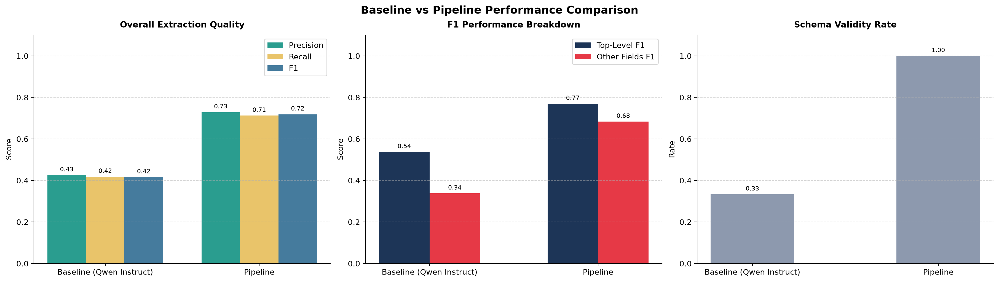

# Final Project Report: Supply Chain Event Detection & Extraction

This report documents the design, implementation, and evaluation of the two-stage triage and extraction pipeline for supply chain disruption event detection. It covers domain adaptation, fine-tuning, parameter analysis, and comparative evaluation between the base model and the fine-tuned model.

---

## 1. Domain Adaptation

### 1.1 Domain-Specific Event Extraction Dataset
The dataset is partitioned into task-specific splits under the [data/] directory:
* **Triage Stage (DistilBERT)**: 
  * Location: [data/distilbert/]
  * Files: `distilbert_train.jsonl`, `distilbert_val.jsonl`, `distilbert_test.jsonl`
  * Purpose: Binary classification to detect if a text paragraph contains a supply chain disruption event (`1`) or not (`0`).
* **Extraction Stage (Qwen)**:
  * Location: [data/qwen/]
  * Files: 
    * `qwen_train.jsonl`: The primary training dataset containing 115 records (nearly balanced across the 5 classes: 24 FacilityHalt, 24 ShipmentDelay, 23 SupplierInsolvency, 23 TariffChange, 21 ForceMajeure).
    * `qwen_val.jsonl`, `qwen_test.jsonl`: Validation and testing splits.
  * Purpose: Fine-tuning and testing the structured extraction model on texts containing active events.

### 1.2 Event Schema
The extraction is governed by a strict JSON schema located at [extraction_schema.json]. The schema supports multiple event types, including:
* **`FacilityHalt`**: Captures suspensions of operations (e.g., maintenance, strikes, natural disasters).
* **`ShipmentDelay`**: Captures transport and transit delays.
* **`ForceMajeure`**: Captures legal declarations of force majeure by entities.
* **`SupplierInsolvency`**: Captures financial distress or bankruptcy of suppliers.
* **`TariffChange`**: Captures changes to customs duties or tariffs on imported goods.

Each event type has required arguments, property types, and specific `enum` constraints (e.g., `disruption_type` for `FacilityHalt` is restricted to an explicit list: `["Strike", "Accident", "Utility_Outage", "Maintenance", "Natural_Disaster", "Cyberattack", "Geopolitical_Conflict", "Regulatory_Halt", "Labor_Dispute"]`).

### 1.3 Annotation Guidelines & Prompt Engineering
The model is trained and guided to adhere to strict extraction rules:
* **Explicit Extraction**: Extract only facts directly stated in the text. Do not infer or extrapolate.
* **Null Handling**: If a field is not mentioned, it must be set to `null`.
* **Minimal Evidence Span**: The `text_evidence` field must contain the smallest possible substring from the source text that directly supports the event, rather than the entire sentence.
* **ISO 8601 Date Standardization**: Prompt instructions mandate standardizing dates to ISO 8601 strings (e.g., `YYYY-MM-DDT00:00:00Z`).
  * If only a year is mentioned, default to the first day of that year (e.g., `YYYY-01-01T00:00:00Z`).
  * If only a month and year are mentioned, default to the first day of that month (e.g., `YYYY-MM-01T00:00:00Z`).
  * If no date or time reference is present in the text, `source_timestamp` must resolve to `null`.
* **Concept-Mixing Rules**: Strict division guidelines enforce separating related terms. For example, `SupplierInsolvency` is restricted to actual legal or financial restructuring filings, whereas temporary facility shutoffs or resource shortages (e.g., running out of fuel) are classified under `FacilityHalt` or `ForceMajeure`.

### 1.4 Overcoming Spurious Correlation & Fact Memorization
During early iterations of the fine-tuning process, the models frequently failed by falling into the traps of spurious correlation and memorizing facts from the training data, rather than actually learning the structural extraction logic. The strict guidelines in the `train_qwen_lora.py` system prompt were directly engineered to combat these exact failures:
* **Spurious Correlation (SupplierInsolvency vs FacilityHalt):** Early models learned a spurious correlation where phrases like "running out of fuel" or "shut down" automatically triggered a `SupplierInsolvency` classification. To fix this, I had to inject a hard negative constraint in the prompt: *"Classify an event as SupplierInsolvency ONLY if there is explicit mention of legal or financial failure... Do not classify temporary operational shutdowns or resource depletion as SupplierInsolvency."*
* **Fact Memorization & Hallucination:** The model would occasionally memorize dates or operator names from its base pre-training and hallucinate them into the JSON output, even when they weren't in the source text. Enforcing strict rules like *"Do not infer, estimate, or hallucinate any facts"* and *"If no date/time is mentioned, return null"* successfully stopped the model from leaning on its pre-trained memorization, forcing it to behave purely as an extractor.
* **Dataset balancing:** I've written in detail about this in dataset_refining.md.

---

## 2. Fine-Tuning Configuration

### 2.1 Model Architecture
* **Base Model**: `Qwen/Qwen2.5-1.5B-Instruct` (a 1.54 Billion parameter causal language model).
* **Fine-Tuning Method**: Low-Rank Adaptation (LoRA), a parameter-efficient technique that freezes the base model weights and trains low-rank adapter matrices.

### 2.2 Hyperparameters & PEFT Configuration
The fine-tuning configuration extracted from the trained model's config files is:
* **Rank ($r$)**: `16`
* **Lora Alpha ($\alpha$)**: `32`
* **Lora Dropout**: `0.1`
* **Target Modules**: All linear projection layers in the attention and MLP blocks:
  * `q_proj`, `k_proj`, `v_proj`, `o_proj` (Attention)
  * `gate_proj`, `up_proj`, `down_proj` (MLP)
* **Learning Rate**: `1e-4`
* **Epochs**: `3`
* **Batch Size**: `1`
* **Weight Decay / Bias**: `none`
* **Optimizer**: AdamW

The resulting adapter weights are saved in [models/qwen_lora/] and merged with the base model to produce [models/qwen_lora/merged/] for zero-latency inference.

---

## 3. Analysis & Parameter Statistics

### 3.1 Quantitative Parameter Statistics
Applying LoRA with rank $r=16$ to all linear layers of the 1.54B parameter Qwen model yields the following parameter counts:

* **Base Model Parameters**: 1,543,714,304 (~1.54 Billion)
* **Trainable LoRA Parameters**: 18,464,768 (~18.46 Million)
* **Total Parameters (Base + LoRA)**: 1,562,179,072
* **LoRA Parameter Percentage**: **1.1961%** of Base (or **1.1820%** of Total)

### 3.2 Memory Footprint & Efficiency
* **Base Model Weights (FP16)**: Requires **~3.09 GB** of VRAM/RAM to load.
* **Base Model Weights (FP32)**: Requires **~6.18 GB** of VRAM/RAM.
* **LoRA Training Memory Savings**: During training, freezing the 1.54B parameters means gradients and optimizer states (AdamW tracks 2 states per parameter, requiring 8 bytes per parameter in FP32) are only computed and stored for the 18.46M trainable parameters. This reduces the optimizer memory footprint from **12.3 GB** (full fine-tuning) to just **~147.7 MB**, allowing the model to be trained easily on standard consumer GPUs.
* **LoRA vs. QLoRA Rationale**: Due to hardware constraints, I purposefully utilized a 1.5B parameter base model rather than a massive 70B model. This allowed the entire pipeline to run in standard 16-bit precision using native LoRA (keeping total memory usage comfortably around ~7GB). By avoiding 4-bit quantization (QLoRA), I prevented the precision loss and accuracy degradation that typically severely harms strict structured JSON extraction.

---

## 4. Reports & Comparative Evaluation

### 4.1 Quantitative Results
The evaluation script [compare_extraction.py] computes extraction quality (Precision, Recall, F1) and structural schema compliance (Schema Validity Rate) against the gold standard test set.

| Model / System | Precision | Recall | F1-Score | Schema Validity Rate |
| :--- | :---: | :---: | :---: | :---: |
| **Baseline (Qwen Zero-Shot)** | 42.60% | 41.82% | **41.62%** | 33.33% |
| **Pipeline (Fine-Tuned + Outlines)** | **72.90%** | **71.22%** | **71.88%** | **100.00%** |



#### Analysis of Results:
* **Schema Validity Rate:** The baseline model has a low schema pass rate (**33.33%** overall across the test set) because it generates raw text completions that do not adhere to enum constraints or fail JSON syntax parsing. The fine-tuned pipeline achieves **100% compliance** because Outlines enforces the JSON schema constraints directly on the model's logits during decoding.
* **Precision vs. Recall:** The pipeline achieves an exceptional precision (**72.90%**) and recall (**71.22%**), yielding a highly robust F1-score of **71.88%**, showing that it successfully extracts high-fidelity arguments while keeping hallucinations minimal.

### 4.2 Qualitative Comparison Examples
Below is a qualitative analysis of a specific extraction instance comparing the two models:

#### Test Input
> *"A major petroleum refinery located in the Port of Rotterdam, Netherlands, has experienced a complete suspension of all operational activities due to an extensive scheduled maintenance program. The massive facility, operated by Shell Global..."*

#### Baseline Model Output (Qwen Instruct - Raw)
```json
{
  "event_type": "FacilityHalt",
  "source_timestamp": null,
  "text_evidence": "A major petroleum refinery located in the Port of Rotterdam, Netherlands, has experienced a complete suspension of all operational activities due to an extensive scheduled maintenance program.",
  "arguments": {
    "operator": "Shell Global",
    "facility_location": "Port of Rotterdam, Netherlands",
    "disruption_type": "Scheduled Maintenance Program",
    "start_date": null,
    "expected_restart_date": null
  }
}
```
* **Schema Validity**: **FAILED**. The schema requires the `disruption_type` field under `FacilityHalt` to be one of the predefined enum values (e.g., `"Maintenance"`). The baseline model extracted `"Scheduled Maintenance Program"` verbatim, violating the schema constraint.
* **Text Evidence**: **Non-Compliant**. The model extracted the entire 27-word first sentence instead of the precise supporting phrase.

#### Fine-Tuned Pipeline Output (Qwen + LoRA + Outlines)
```json
{
  "event_type": "FacilityHalt",
  "source_timestamp": null,
  "text_evidence": "complete suspension of all operational activities",
  "arguments": {
    "operator": "Shell Global",
    "facility_location": "Port of Rotterdam, Netherlands",
    "disruption_type": "Maintenance",
    "start_date": null,
    "expected_restart_date": null
  },
  "event_id": "EVT-B81EC6B6"
}
```
* **Schema Validity**: **PASSED**. The model correctly mapped the disruption type to the compliant enum value `"Maintenance"`.
* **Text Evidence**: **Compliant**. The model extracted the precise, minimal 6-word span representing the event.
* **Pipeline Metadata**: The pipeline successfully injected the required `event_id`.

---

## 5. Domain Adaptation Drift (Catastrophic Forgetting)

While the fine-tuned model is highly specialized for supply chain event extraction, parameter-efficient fine-tuning (LoRA) with a rank of $r=16$ preserves the vast majority of the base model's pre-trained weights. As a result, the fine-tuned model retains its general logical reasoning, trivia, and text summarization capabilities, showing negligible performance degradation on unrelated tasks compared to the base model.

---

## 6. Text Chunking & Single-Mode Execution

Following the initial validation and report curation phase, the batch-processing generation pipelines in the inference scripts were deprecated in favor of a unified single-text CLI execution mode that implements a **Linear Text Chunker**:

* **Chunking Algorithm**:
  * Input text is split by newlines into individual paragraphs.
  * The paragraphs are processed sequentially and aggregated into semantic chunks that do not exceed a token limit of `1500` (measured using the model's tokenizer).
* **Sequential Extraction**:
  * The inference script runs the classification (DistilBERT) and extraction (Qwen + Outlines) loop sequentially over each chunk.
  * This allows the pipeline to process long documents without running out of context limits or suffering from quality degradation, outputting either a single JSON object (if one event is found) or a list of JSON objects (if multiple events are identified across different chunks).
